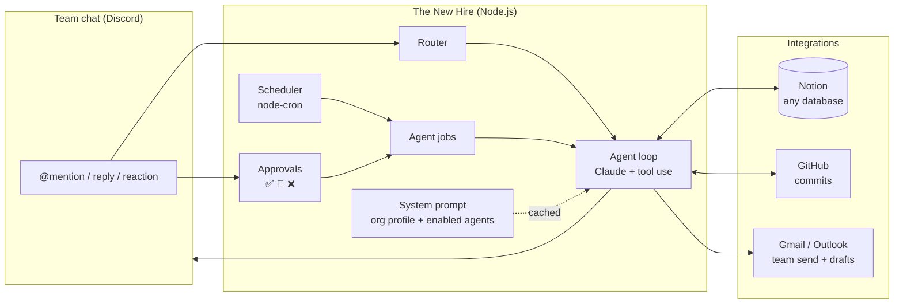

# The New Hire

**An AI operations teammate that lives in your team chat.** It connects to the tools a small business already uses (Notion, GitHub, Gmail/Outlook) and takes on the recurring work no one has time for: weekly performance reviews, long-form articles, social drafts, pipeline tracking, and team digests.

You talk to it like a colleague. Nothing is hard-coded to one company: a single JSON profile describes your business, brand voice, channels and databases, and the agents adapt.

```
#marketing
  Sam:  @NewHire catch me up on this week
  Bot:  **Product**: 6 commits shipped: oat-milk subscriptions went live, and checkout
        no longer double-charges on retry…
        **Pipeline**: 41 wholesale leads, 9 contacted this week, 2 replies (Daily Grind, Bean There).
        3 are due a follow-up.
        **Content**: Ethiopia origin story is ready to publish; Instagram and LinkedIn drafts
        are waiting in Notion…
```

---

## What it does

| Agent | You say… | It does… |
|---|---|---|
| **Analyst** | "run the analyst" + paste last week's stats | Finds what worked and why, writes recommendations to Notion, and summarises what shipped from GitHub |
| **Writer** | "write an article about cold brew at home" | Writes a full article in your brand voice, saves the brief to Notion and emails it to the team |
| **Social** | "create this week's social drafts" | Writes one draft per platform using the analyst's insights and saves them for review |
| **Pipeline** | "how's the pipeline?" / "Acme replied" | Gives counts by stage and recent activity, updates contacts, drafts follow-ups (never sends them) |
| **Digest** | "catch me up" | A product + pipeline + content + team summary in under 400 words |
| **Memory** | (automatic) | Summarises every channel daily, so it remembers decisions made anywhere in the workspace |

Scheduled jobs run without anyone asking. Every Friday it **proposes an article brief and waits for approval**: react ✅ to write it, 🔄 for another angle, ❌ to skip, or reply with a different direction. Unanswered proposals expire. They are never auto-approved.

## Architecture



**Key design decisions**

- **Config, not code, defines the business.** `config/org.json` holds the name, voice rules, channel names, enabled agents, schedule and Notion databases. Swap the profile and it's a different company's teammate.
- **Schema-aware Notion layer.** The agent reads and writes plain key/value objects. The integration fetches each database's live schema and maps values to the right property types, so any database layout works with no code changes.
- **Capability-driven prompt.** The system prompt is composed from the profile and from whatever is actually connected. If GitHub isn't configured, the agents aren't told about it and the tool doesn't exist.
- **Cost-aware model use.** The system prompt and tool list are deterministic (no dates or IDs), so they're served from the prompt cache. Volatile context (today's date, recent chat, channel memory) goes in the user turn. Chat runs at low effort; long-form writing runs at high effort with a larger output budget.
- **Safe by default.** The agent can only *send* email to the team inbox. Anything addressed outside the team is saved as a draft for a human to send. Social posts are drafts too. Refusals are handled, and server-side model fallbacks are enabled.
- **Parallel tool calls.** When Claude asks for several tools at once, they run concurrently and all results go back in one message. Tool failures come back as `is_error` results the model can recover from, not crashes.
- **Platform-agnostic agents.** Agents and jobs only see a three-method `chat` interface, and everything Discord-specific lives in `src/chat/discord.mjs`.

## Project structure

```
src/
├── index.mjs              # Wires config → integrations → tools → agents → chat + scheduler
├── config.mjs             # Loads and validates the org profile, resolves env
├── core/
│   ├── agent.mjs          # Claude tool-use loop (streaming, adaptive thinking, fallbacks)
│   ├── prompt.mjs         # Builds the cacheable system prompt
│   ├── tools.mjs          # Tool registry (stable ordering, error capture)
│   ├── approvals.mjs      # ✅/🔄/❌ human-in-the-loop with expiry
│   ├── scheduler.mjs      # Cron jobs from the profile
│   └── text.mjs
├── integrations/          # notion · github · email (Gmail / Outlook)
├── agents/                # analyst · writer · social · pipeline · digest · memory
└── chat/discord.mjs       # Discord adapter
config/org.example.json    # Example profile (a fictional coffee roaster)
scripts/                   # One-off OAuth helpers for Gmail and Outlook
test/                      # node:test suite, no network or API keys needed
```

## Getting started

**Requirements:** Node 20+, an [Anthropic API key](https://console.anthropic.com/) and a [Discord bot](https://discord.com/developers/applications) with the *Message Content* intent enabled.

```bash
git clone https://github.com/illegalfish14/the-new-hire.git
cd the-new-hire
npm install

cp .env.example .env                        # add your keys
cp config/org.example.json config/org.json  # describe your business

npm run check   # shows what's connected, without starting the bot
npm start
```

Then mention the bot in any channel it can see. Run any scheduled job on demand with `@NewHire run digest.post`.

Every integration beyond Anthropic + Discord is optional. Connect what you use:

| Integration | Setup |
|---|---|
| Notion | Create an [internal integration](https://www.notion.so/my-integrations), share your databases with it, and set `NOTION_TOKEN` plus a `NOTION_*_DB` ID for each database. See [docs/notion-setup.md](docs/notion-setup.md) for suggested schemas. |
| GitHub | A fine-grained token with read access to `contents`, plus `GITHUB_REPO=owner/repo` |
| Gmail | OAuth client ID/secret, then `npm run token:gmail` |
| Outlook | Entra ID app registration, then `npm run token:outlook` |

## Customising

**A new business:** edit `config/org.json`. The `voice` rules are applied to everything written for publication, and `databases` can describe any Notion database. The descriptions are what the agent reads to understand them.

**A new agent:** add a module to `src/agents/` and list it in `src/agents/index.mjs`:

```js
export default {
  name: 'support',
  title: 'Support triage',
  instructions: (config, caps) => `When someone pastes a customer email, …`,
  jobs: {
    async morningQueue(app) { /* app.agent, app.notion, app.chat, app.approvals */ },
  },
};
```

Then enable it in the profile, and schedule its jobs with `{ "cron": "0 9 * * 1-5", "job": "support.morningQueue" }`.

**A new tool:** return `{ name, description, input_schema, run }` objects from an integration and register them in `assemble()`.

## Tests

```bash
npm test
```

Covers the agent loop against a scripted fake client (parallel tools, tool errors, refusals, iteration limits, request shape), the Notion property mapping and pagination, config validation, approvals and expiry, prompt determinism, email header-injection protection, and the schedule against the registered jobs.

## Built with

[Claude](https://www.anthropic.com/claude) via the Anthropic SDK · discord.js · node-cron · Notion, GitHub, Gmail and Microsoft Graph REST APIs

## License

MIT
